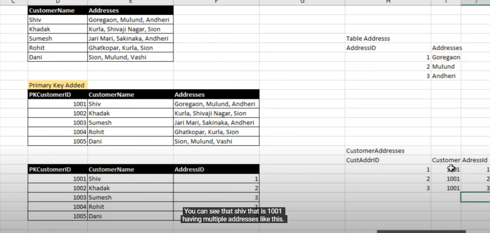

### Update Columns
update user set password = (CASE WHEN password = 'pal' THEN 'singh' ELSE 'PAL' END)

### Normalization

- Normalization help us to remove data redundancy by minimize the duplication of stored data..
- Normalization rule says divide the larger table into the smaller tables or into the logical tables and link them using the relationship join.

### DeNormalization
- Denormalization go opposite of normalization here we merge two tables to improve search performance

#### First Normal Form (1NF)
- Should have Primary Key.
- All columns contain atomic (indivisible) values.
- Each column has a unique name.
- The order in which data is stored does not matter.
- Created table for city and for address new table ie. customer address(that will have custerid and address id)


#### Second Normal Form (2NF)
- It is in 1NF.
- No partial dependency on a composite primary key
- Before

- After


#### Third Normal Form (3NF)
- Is is in 2NF
- There should be no transitive dependency (If C is dependence on B and B is depence on A, hence A is also dependence on C)
- Before

- After


### What is trigger? How you can create a trigger in MYSQL?
- A MySQL trigger is a stored program (with queries) which is executed automatically to respond to a specific event such as insertion, updation or deletion occurring in a table.
- The trigger can be executed when you run one of the following MySQL statements on the table: INSERT, UPDATE and DELETE and it can be invoked before or after the event.
```sql
DROP TRIGGER IF EXISTS tr_date_user;
CREATE TRIGGER tr_date_user
BEFORE INSERT ON `user`
FOR EACH ROW
SET NEW.created_at = NOW();
```

### What is Transaction and how to implement?
- Transaction helps us to execute group of statements like Select, Insert, Update and Delete as one logical unit.
- Either all modification is successful when the transaction is committed.
- Or, all modifications are undone when the transaction is rollback.
```sql
START TRANSACTION;
INSERT INTO `user` (`username`,`password`) VALUES('Nisha','N1');
INSERT INTO `user` (`username`,`password`) VALUES('Sakshi','S1');
COMMIT; --- Or ROLLBACK; 
```
### What is Index and how can we declared?
- An Index in mysql helps to improve speed of operations in a table.
```sql
CREATE INDEX `user_index_name` ON `user`(`username`);
DROP INDEX `user_index_name` ON `user`;
```

### What is view? How can we create?
- Database view are virtual table that are generated by the query output.
- The output which is generated by join or complex query we can give the virtual table name as `view`
```sql
CREATE VIEW `check_same_password_view` AS SELECT password, COUNT(password) FROM `user`  GROUP BY PASSWORD;
DROP VIEW `check_same_password_view`;
```

### Explain Inner Join?
- Inner join will give the matching record from both the table
- Retrieves records that have matching values in both tables based on the join condition. 
- This is the most common type of join
```sql
SELECT table1.column, table2.column from table1 INNER JOIN table2 on table1.column_id = table2.columnd_id

SELECT orders.order_id, customers.name
FROM orders
INNER JOIN customers ON orders.customer_id = customers.id;
```
### Explain Left Join?
- Returns all records from the left table (the table mentioned first in the `FROM` clause), and matching records from the right table. If there's no match in the right table, it fills the corresponding columns with NULL values.
```sql
SELECT orders.order_id, customers.name
FROM orders
LEFT JOIN customers ON orders.customer_id = customers.id;
```
### Explain Right Join?
- Similar to a left join, but returns all records from the right table (the table mentioned second in the `FROM` clause) and matching records from the left table. 
- Fills unmatched columns in the left table with NULL values.
```sql
SELECT * FROM table1
RIGHT JOIN table2 ON table1.column1 = table2.column2;

```

### Explain Full  Join?
- Returns all records from both tables involved in the join, including those with and without matching values in the other table. 
- Unmatched columns are filled with NULL values.
```sql
SELECT * FROM table1
FULL JOIN table2 ON table1.column1 = table2.column2;
```

### Explain Cross  Join?
- Creates a Cartesian product of the tables involved. 
- This results in all possible combinations of rows from both tables, regardless of any relationship between them. 
-  It's generally less common than other join types.
```sql
SELECT * FROM table1
CROSS JOIN table2;
```

### Union vs Union All?
- Both `UNION` and `UNION ALL` in MySQL are used to combine the results of two or more SELECT statements into a single result set.
- Union 
    - Returns only distinct (unique) rows from the combined results.
- Union All
    - Returns all rows from the combined results, including duplicates.
    - It simply concatenates the results of the SELECT statements without any deduplication.