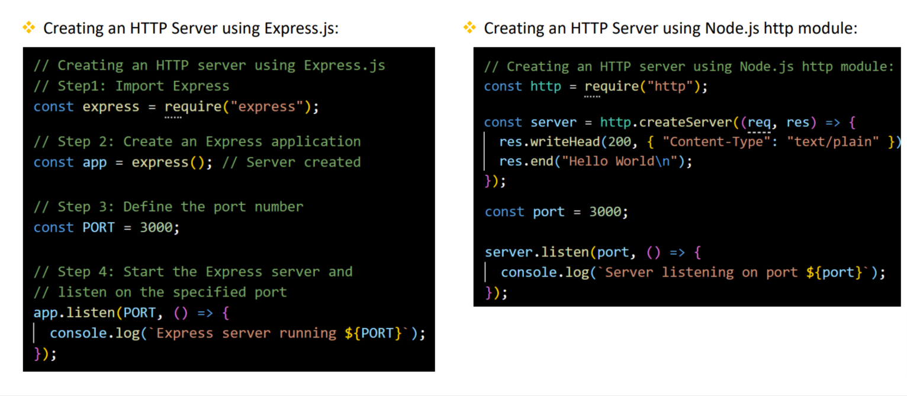
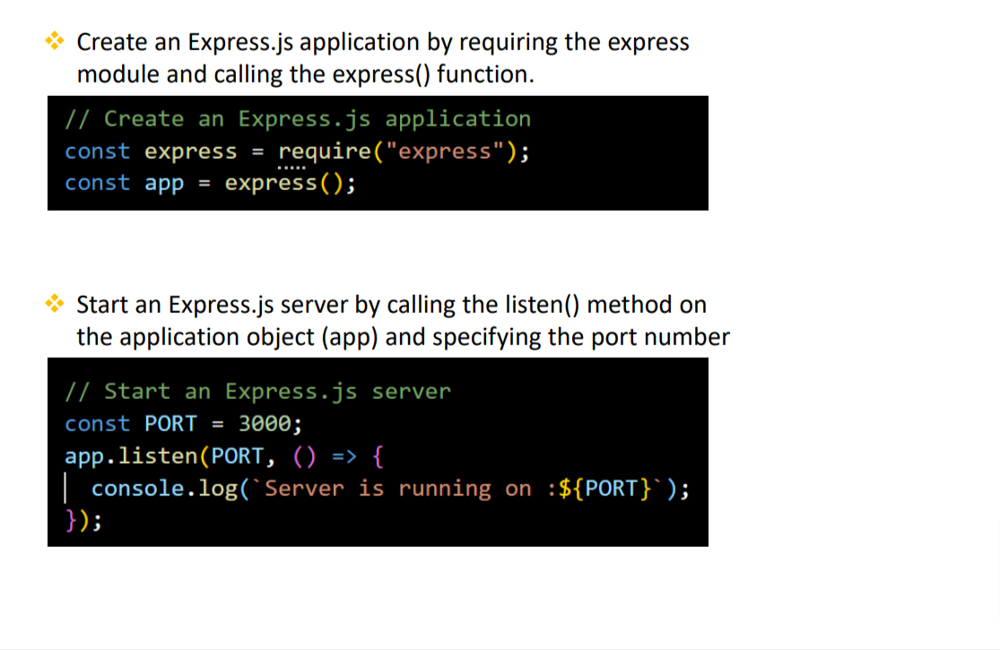

Q. What are the advantages of using Express.js with Node.js?
1. Simplified Web Development
    - Express.js provides a lightweight framework that simplifies the process of building web applications in Node.js
    - With many built in methods and features
2. Middleware Support
    - Easy integration of middleware functions into application's request-response cycle.
3. Flexible Routing system
    - Defining routes for handling different HTTP methods (GET, POST, PUT, PATCH, DELETE, etc.) and URL patterns in easy.
4. Template Engine Integration
    - Express.js supports various template engines making it easy to generate dyanmic HTML content on the server side.

Q. How do you install Express.js in a Nodejs in a Node.js
```
npm install express
```
Q. How to create an HTTP Server using Express.js


Q. How do you create and start Express.js application
