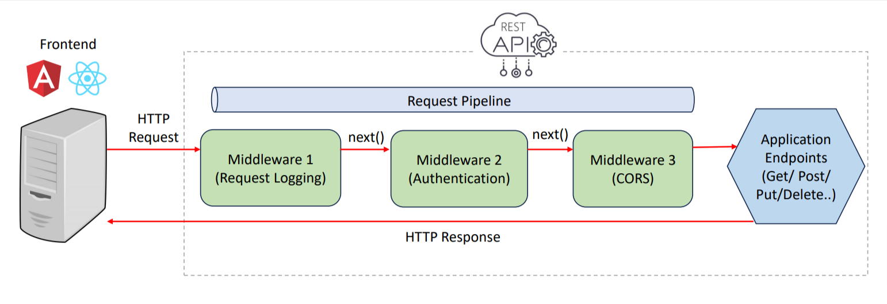
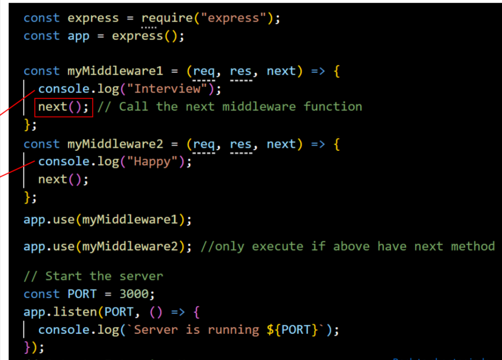
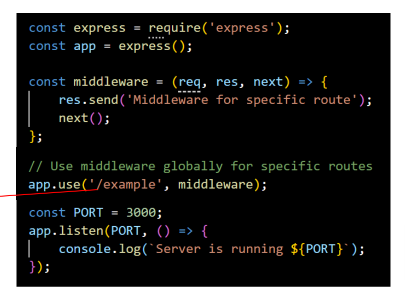

## Middleware
Q. What is middleware in Express.js and when to use them?
- A middleware in Express.js is a function that handles HTTP request, performs operations and passes control to the next middleware.\


Q. How do you implement middleware in Express.js
1. Initialize an Express appliation.
2. Define a middleware function myMiddleware.
3. Use app.use() to mount myMiddleware globally, meaning it will executed for every incoming request to the application.
4. Finally, we start the server by listening on a specified port(default to port 3000) using  app.listen()
```js
// Create and execute middleware
const express = require("express");
const app = express();
// Define middleware function
const myMiddleware = (req, res, next) => {
  // Middleware logic goes here
  res.send("Interview Happy!");
  next(); // Call the next middleware function 
};

// Use middleware globally for all routes
app.use(myMiddleware);
// Start the server
const PORT = 3000;
app.listen(PORT, () => {
  console.log(`Server is running ${PORT}`);
});
```
Q. What is the purpose of the app.use() function in Express.js?
- The app.use() method is used to <b>execute(mount) middleware</b> functions globally.

Q. What is the purpose of the <b> next parameter</b> in Express.js?
- The next parameter is a callback function which is used to <b>pass control to the next middelware</b> function in the stack.


Q. How to use middleware globally for a specific route?
- Use <b>app.use('/specificRoute', myMiddleware)</b> to use middleware globally for a specific route in Express.js


Q. What is Request Pipeling in Express?
- The request pipeling in Express.js is a series of middleware functions that handle incoming HTTP requests and pass control to the next function.
