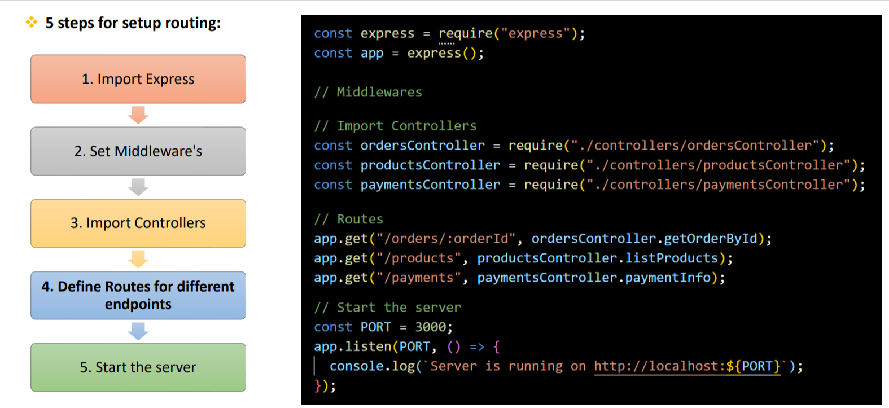

Q. What is Routing in Express.js?
- Routing is the process of directing incoming HTTP requests to the appropriate handler functions based on the request's method (eg. GET, POST) and the URL path.

Q. How to implement routing? How do you define routes in Express.js?
- To implment routing first define the routes.
- In Express.js routes are defined using the <b>app.METHOD() functions.</b>(where METHOD is the HTTP request method (eg. GET, POST, PUT, PATCH, DELETE) and app is an instance of the Express application).

Q. How to handle Routing in Express.js real applications?

Q. What are the Route Handlers?

### Advance

