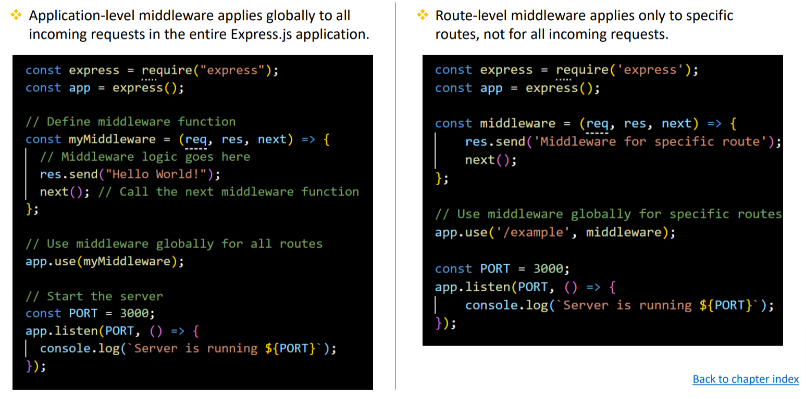
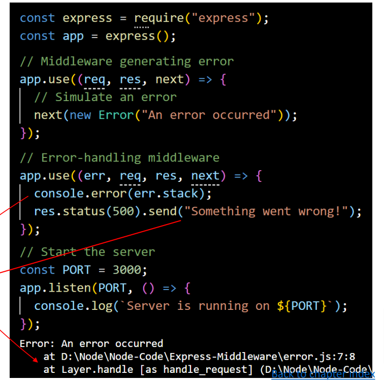
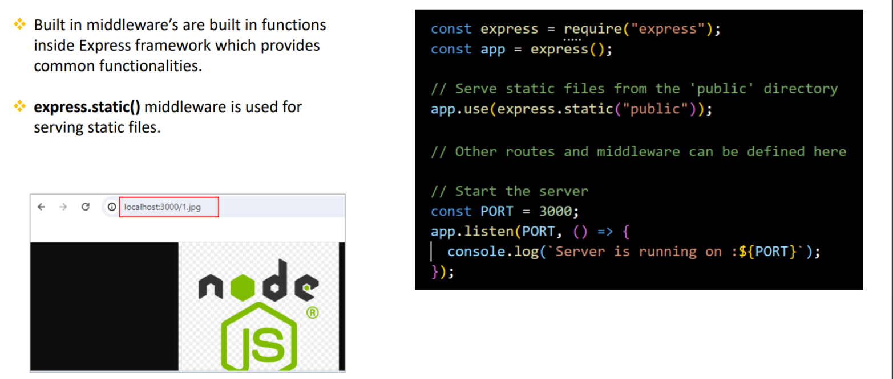
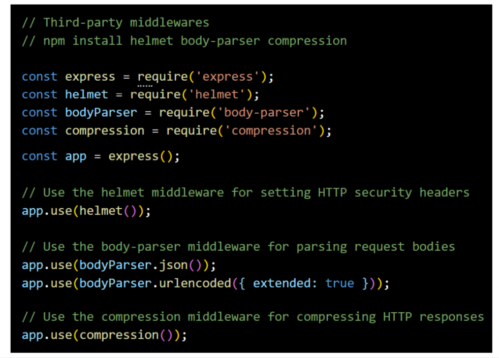

### Type of middleware 
Q. What are the Types of middleware's in Express.js? summarize?
- 5 Types of middleware
1. Application-leve middleware
    - Middleware applited to all routes, commonly used for logging, authentication, etc.
2. Router-level middleware
    - Middleware spcific to certain routes, applied using or.
3. Build-in middleware 
    - Pre-packaged middlewaer included with Express.js like serving static files.
4. Error-handling middleware
    - Middlware for handling errors, declared after other middleware, triggerd on errors.
5. Third-party middleware
    - Middleware developed by others, not part of Express.js core add various functionalities.

Q. What is the difference btw application-level & route-level middleware?
- Application-level middlware applies globally to all incoming requests in the entire Express.js Application
- Route-level middleware applies only to specific routes, not for all incoming request.

Q. What is error handling middleware and how to implment it?
- Error handling middleware in Express is a special kind of middleware used to <b>manage erros</b> happening while handling incoming requests.
- To implmenet error handling in Expres, define middlweware with fout parameters(err,req,res,next). Here the additional error object parameter will be used for error handling.

Q. If we have 5 middlewars then in which middleware you will do the error handling?
- In case of multiple middleware, error-handling middleware should be <b>defined at last</b>(after all other middleware's) becuase when an error occurs.
- Express.js will search for the next error-handling middleware skipping any regualr middleware or route handlers.

Q. What is <b>built in</b> middleware? How to server static files from Express.js?
- Built in middeware's are build in functions inside Express framework which provides common functionalities.
- <b>express.static()</b> middleware is used for serving static files.

Q. What are third-party middleware's?
- Third-party middleware in Express.js are modules developed by third-party developers(not part of the core Express.js)
- Third-party middleware's provide functionalities like logging, secruity, body parsing and compression.
- Example of third-party middlewar's: morgan, helment, body-parser, compress, etc.

Q. What are the advantages of using middleware in Express.js
1. Modularity
    - Middleware allows you to modularize your application's functionality into <b>smaller, self-contained units.</b> Each middleware function can handle a specific task or concern, such as logging, authentication or error handling.
2. Reusability
    - Middlewares can be reused at multiple places and that makes application code easier to maintain.
3. Improved Request Handling
    - Middleware functions have access to both the request(req) and response(res) objects which enables you to perform <b>validations on request</b> or moodify the response before sending it back to the client.
4. Flexible Control Flow
    - Middleware functions can be applied globally to all routes or selectively to specific routes, allowing you to control the flow of request processing in your application.
5. Third-party Middlewar's
    - Express.js offers a wide range of third-party middleware packages that provide additional functionality. for eg. body-parser, cors, etc.
