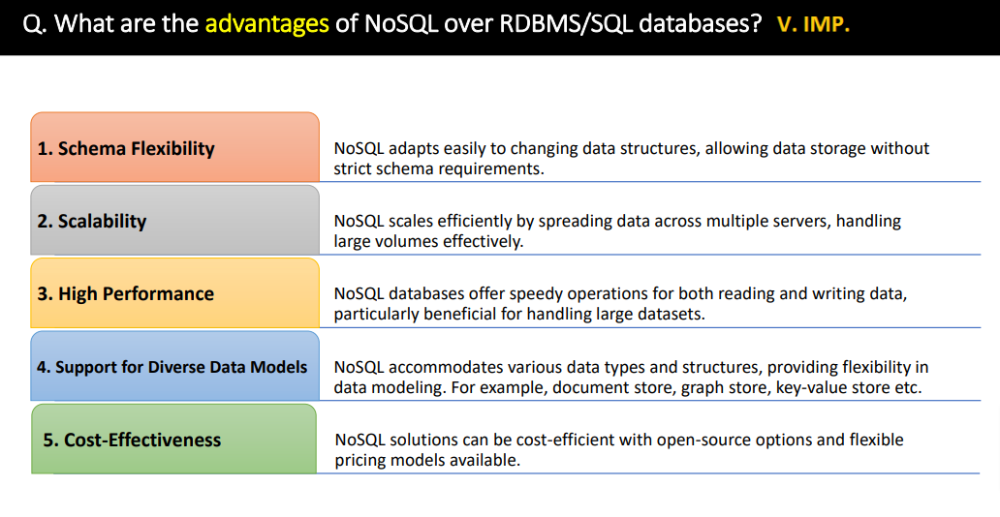
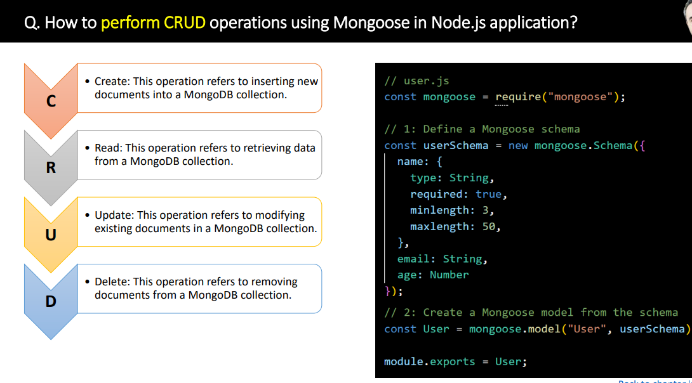

### MongodDB
Q. What is MongoDB?
- MongoDB is a popular open-sources, NoSQL database management system.

Q. What is NoSQL

### Operator & Advance

### Indexes
Q. What is index
- In MognoDB, indexes provide high-perforamnce read operations for frequently used queries.
 - `db.NAME_OF_COLLECTION.createIndex({key:1})`
 - `db.NAME_OF_COLLECTION.dropIndex({key:1})`
 - `db.NAME_OF_COLLECTION.getIndexs()`

### Mongoose

### Extra
Q Default, which index is crated by MongoDB
- `_id` collection for every collection by MongoDB
Q Inserting into document
-  `database.collection.insert (document)`
Q What are Embedded documdents?
- Embedded documents capture realtionships between data by storing related data in a single docoument structure.

Q What is vertical Scalling?
- Vertical scaling adds more CPU and storage resources to increase capacity.

Q. Horizontal scaling.
- Divides the dataset and distributes data over multiple servers or shards.

Q. Command to drop a database?
- `db.dropDatabase()` command

Q What is pretty() method?
- The `pretty()` method is used to show the results in a formatted way.

Q Which method is used to remove a document from a collection?
 - the  `remove()` method is used to remove a document from a collection.

Q Projection in MongoDB?
- Project only select the particular data not all data.

Q How to create database in mondoDB?
 - There is no command to creaet db just use `use database` if it doesn't exist will created

 Q. Create collection in MongoDB?
 - `db.createCollection(name, option)`
 - `db.collection.drop()`

 Q What kind of database is MongoDB?
  - MongoDB is a document-oriented DBMS.
  - Think of MySQL but JSON-lik objects comprising the data mode, rather than RDBMS tables.
  - MongoDB not supports transactions.

  Q Does MongoDB database stores its data in tables?
  - A mongoDB database stores its data in collections instead of tables, which are the rough equivalent of RDMBS tables.

  Q Do mongoDB database have schemas?
  - MongoDB uses dynamics schemas.
  - Whitout defining the structure you can crate collections.

Q What is typical uses for MongoDB?
- Content Management Systems, Mobile Application, gaming, analytics and logging.

Q. Does mongoDB require a lot of RAM?
- Not necessarily
- Its certainly possible to run MongoDB on a machine with a small amount of free RAM
- it's Automatically uses all free memory on the machine as it cache.

Q. Does mongoDB handle caching?
- Yes. MongoDB keeps all of the most recently used data in RAM.
- If you have created indexes for your queries and your working data set fits in RAM, Its servers all queries from memory.

Q. Why MongoDB is best NoSQL Database?
- Document Oriented.
- Rich Query language.
- High Performance.
- High Available
- Easily Scalable

Q. Does MongoDB support primary-key, foreign-key realtionship?
- No. By Default

Q. Can you achieve primary key- foreign key relationshiop?
- We can achieve primary key - foreign key realtionship by embedding one document inside antoher
- Eg. An address document can be embedded inside a customer document.

Q. Limit in MongoDB
- `db.collection_name.find({}).limit(NUMBER)`

Q. Sort in MongoDB
- `db.collection_name.find({}).sort({KEY:-1})`

Q. Command to backup of the database?
- `mongodump` comaand is used to create backup.

Q. Restore the backup
- `mongorestore` is used.

Q What is Collection in MongoDB?
- In MongoDB a collection is a group of documents.

Q. Command used to update a documents.
- `update()` & `save()`

Q. Skip method
-  `db.collection_name.find({}).skip(2).limit(1)` // To get the third highest value

Q. What is use of Dot notation
- Its use to access the elements of any array and filds of an embeeded document.

Q. Group by
- `db.collection_name.aggregate([ {"$group" : {_id:{source:"$source", status:"$status"}, count:{$sum:1}} }, {$sort:{"count":-1}} ])`
- Below result data will put in array of x,y and z
 
 

Q. Two dates
- `db.collection_name.find({"when_created":{'$gte':ISODate("2024-03-06T13:10:40.294Z"),'$lt':ISODate("2025-03-06T13:10:40.294Z") } })`

Q. How to perform like SQL JOIN equivalent in MongoDB?
-  `$lookup`

Q. Like in MongoDB
 - `db.users.find({name:/a/})` mySQL-> `'%a%'`
 - `db.users.find({name:/^pa/})` mySQL-> `'pa%'`
 - `db.users.find({name:/ro$/})` mySQL-> `'%ro'`
 - or `db.users.find({'name':{'$regrex':'sometext'}})`

Q. Indexing on array

Q. Structure on ObjectID in MongoDB.
- ObjectID is a 12-byte BSON type.
- 4 bytes value represnting seconds
- 3 byte machine identifier
- 2 byte process id
- 3 byte counter

Q. What is Sharding
- Sharing means to store data on multiple machines.

Q. Replication
- It is prcess of synchornizing data across multiple servers.

Q. What is Profiler use
-  Is used to collect data about mongoDB write oprations, curors, database commands on running mongod instance.
- You can enable profiling on a per-database or per instance basis.

