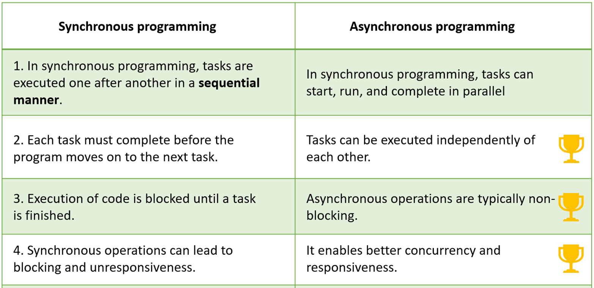
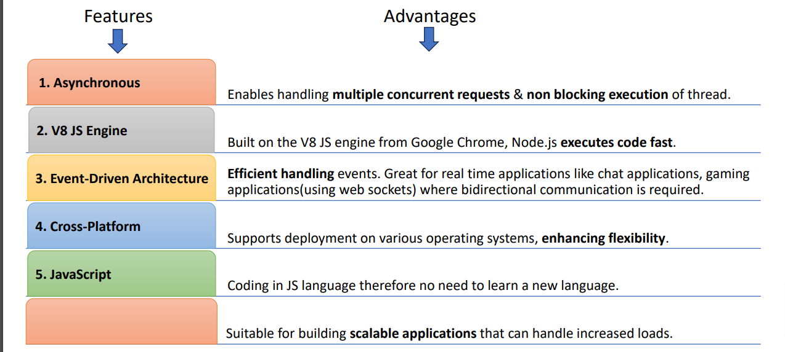
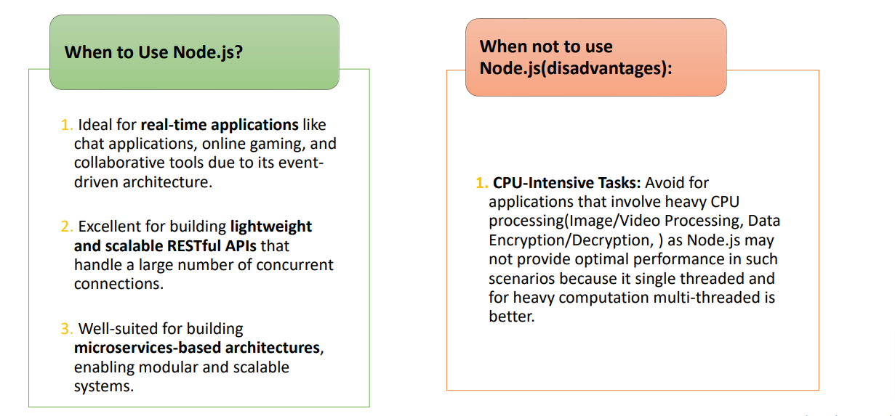

## Description

Q. What are the 7 Mian Features of Node.js?
1. Single Threaded
2. Asynchronous
3. Event-Driven
4. V8 JavaScript Engine
5. Cross-Platform
6. NPM (Node Package Manager)
7. Real-Time Capabilities (Bi directional for chat application)

Q. What is Single Threaded Programming?.\
In single-threaded programming, a program executes instructions one after another, following a single line of control\
Thinnk of it like having one worker on assembly line handling each task sequentially
- Sequential Execution : The program process tasks in the order they appear in the code, Each instruction must completed before next one starts.
- Simple Structure : Single-threaded programs are easier to write and reason about because there's no need to manage multiple threads( independt flows of execution)

Q. What is Synchronous Programming?
- Ina synchronous program, <b>each task is performed one after the another</b> and the programs waits for each operations to complete before moving on to the next one.
- Synchronous programming focuses on the order of execution in a sequential manner, while single-threaded programming focuses on the single thread.

Q. What is Multi Threaded Programming?
- Multithreaded programming is a technique that allows a program to execute multiple threads concurrently.
- Here's a deeper dive into multithreading:
    - Threads: A thread is a lightweight unit of execution within a process (running program). It can be seen as a single stream of instructions within a process. Multiple threads share the process's resources like memory, but they each have their own execution state (program counter, stack).
    - Concurrency vs Parallelism: Multithreading enables concurrency, which means the program can handle multiple tasks seemingly at the same time. However, due to the limitations of most modern CPUs (having a limited number of cores), threads might not always run truly in parallel. The operating system manages thread scheduling, allocating CPU time to each thread efficiently.

Q. What is Asynchronous Programming?
In Node.js asynchromous flow can be achieved by its <b>Single-threaded</b>, <b>non-blocking</b> and <b>event-driven architecture</b>
In Node.js, if there are 4 tasks(task1, task2, task3, task4) to be completed for an event. Then below steps will be exectured:
1. Frist, Thread T1 will be created.
2. Thread T1 initates task1, but it won't wiat for Task1 to completed. Instead, T1 proceeds to initiate Task2, then Task3 and Task4 (This asunchronous execution allows T1 to efficiently handle multiple tasks concurrently).
3. Whenever Task1 completes an event is emitted.
4. Thread T1, being event-driven, promptly responds to this event, interrupging its current task and delivering the result of Task1.

Q. Differences between Synchronous Programming & Asynchronous Programming?

Q. Event's
- Event : Signals that something has happened in a program.
- Event Emitter : Create or emit events.
- Event Queue : Events emitted queued(stored) in event queue.
- Event Handler(Event Listener) : Function that responds to specific events
- Event Loop : The event loop picks up event from the event queue and executes them in  the order they were added.
- Event Driven Architecture : It means operations in Node are drive or based by event (Its a combination of all above event)

Q. What are the main feature & advantages of nodejs?

Q. What are the disadvantages of nodejs?
