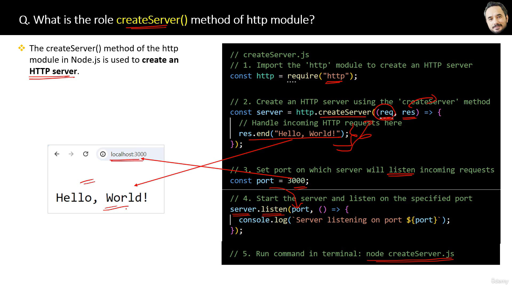

Q. What are the Top 5 built in modules commonly used node.js project?
1. fs
2. path
3. os
4. events
5. http

Q. Explain the roles of fs module? Name some functions of it?\
fs module in Node provides a set of methods for interacting with the file system.\
- 7 Main functions of fs module
1. fs.readFile()\
Reads the content of the file specified
2. fs.writeFile()\
Writes data to the specified file, creating the file if it does not exits.
3. fs.appendFile()\
Appends data to a file. If the file does not exist, it is created.
4. fs.unlink()\
Deletes the specified file.
5. fs.readdir()\
Reads the contents of a directory.
6. fs.mkdir()\
Create a new directory.
7. fs.rmdir()\
Removes the specified directory.

```js
// fs-example.js
const fs = require("fs");

// Reading the contents of a file asynchronously
fs.readFile("fs.txt", "utf8", (err, data) => {
  if (err) {   
    return;
  }
  console.log("File contents:", data);
});

// Writing to a file asynchronously
const contentToWrite = "Some content";
fs.writeFile("fs.txt", contentToWrite, "utf8", (err) => {
  if (err) {
    return;
  }
  console.log("Write operation complete.");
});

```
Q. Explain the roles of path module? Name some functions of it?
```js
const path = require('path');
// Joining path segments together
const fullPath = path.join(__dirname, 'folder', 'file.txt');
// Resolving the absolute path
const absolutePath = path.resolve('folder', 'file.txt');
// Getting the directory name of a path
const directoryName = path.dirname('/folder/file.txt');
// Getting the file extension of a path
const fileExtension = path.extname('/folder/file.txt');
// Parsing a path into an object with its components
const pathObject = path.parse('/folder/file.txt');
// Formatting a path object back into a path string
const pathString = path.format({ dir: '/folder', base: 'file.txt' });

```
[Above Code ](path-example1.js)\
[Another code](path-example.js)

Q. Explain the roles of OS module? Name some functions of it?\
- The OS module in Node.js provides a set of methods for interacting with the operating system.
- We may need OS module so that we can make cross platform application base on OS System.
```js
const os = require('os');
// 1. Fet Platform Information
console.log(os.type()); 
// Output: 'Windows_NT' or 'Linux'...
// 2. Get Current User Information
console.log(os.userInfo());
// Output: {uid: -1, gid: -1, username: 'anaya'...}
// 3. Get Memory Information in bytes
console.log(os.totalmem()); // Output: 14877265920
console.log(os.freemem()); // Output: 4961570816
```

Q. Explain the roles of events module? How to handle events in Node?
- events module is used to handle events.
- EventEmitter class of events module is used to register event listeners and emit events.
- An event listener is a function that will be exectuted when a particular event occurs.
- on() method is used to register event listeners.
- Event should be resigter first then should be emit(invoke)
```js
// import events module
const EventEmitter = require('events');
// Create an instance of EventEmitter class
const myEmitter = new EventEmitter();
// Register an event listener(eventName)
myEmitter.on('eventName', () => {
  console.log('Event occurred');
});
// Emit the event
myEmitter.emit('eventName');
// Output: Event occurred
```

Q. What are Event Arguments?\
Event arguments refers to the additional information or data that can be passed along with an emitted event.
```js
const EventEmitter = require("events");
// Create an instance of EventEmitter class
const myEmitter = new EventEmitter();
// Register an event listener for the 'eventName' event
myEmitter.on("eventName", (arg1, arg2) => {
  console.log("Event occurred with arguments:", arg1, arg2);
});
// Emit the 'eventName' event with arguments
myEmitter.emit("eventName", "Arg 1", "Arg 2");
// Output: Event occurred with arguments: Arg 1 Arg 2
```
Q. What is the difference between a function and an event?
- A function is a resuable piece of code that performs a specific task when invoked or called.
- Event represent actions that can be observed and responded to.
- Events will call functions internally.

Q. What is the role of http module in node?\
The HTPP module can create an HTTP server that listens to server ports and gives a response back to client.


