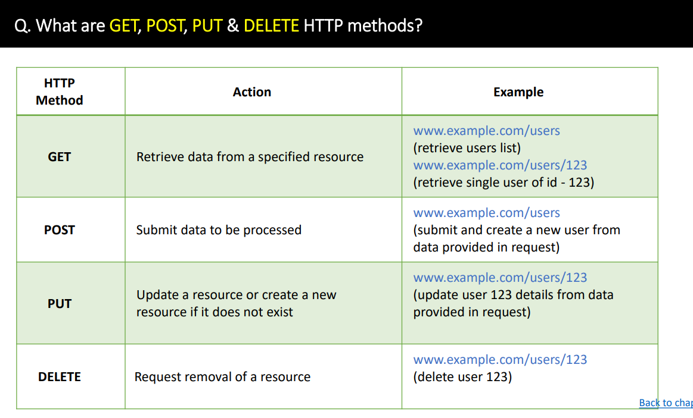
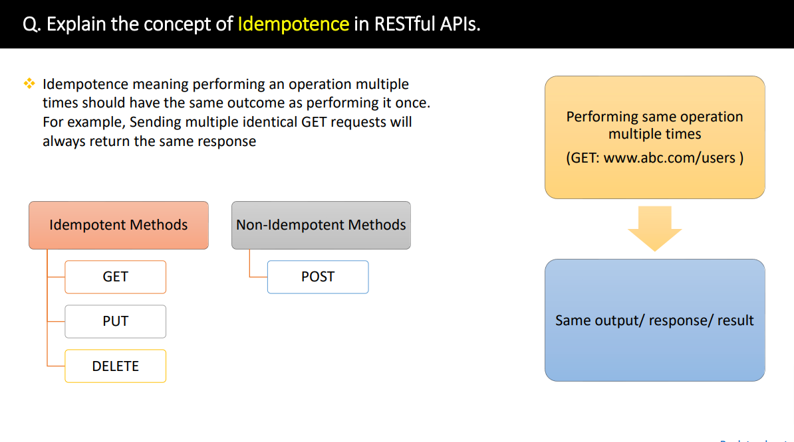
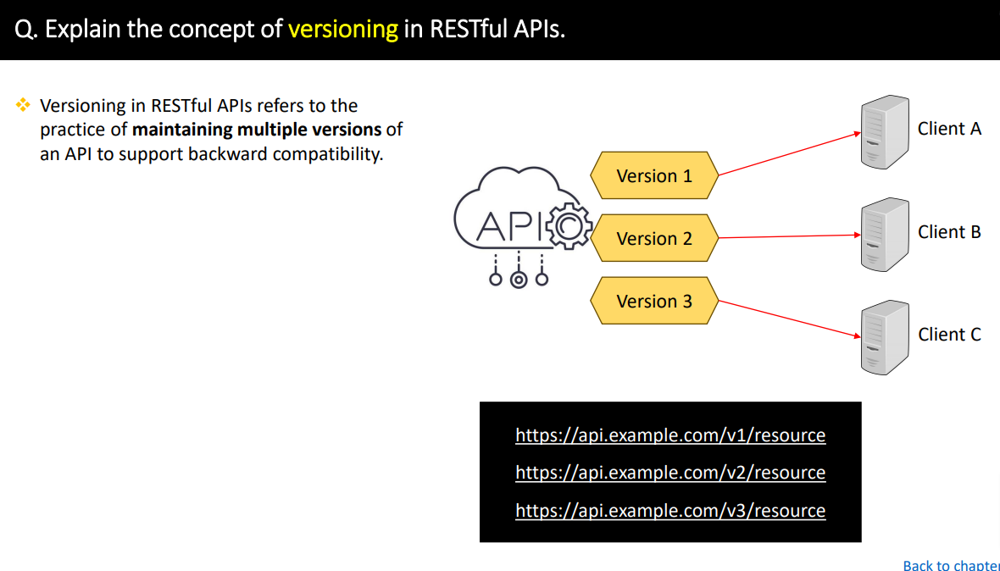

### Rest API
Q. What is REST & RESTful API?

### Rest HTTP Methods & Status Codes

### Cors, Serialization, Deserializatino
Q. What is CORS in Rest API?
- CORS(Cross-Origin Resources Sharing) is the seruity feature implemented in web browsers that retricts web pages or scripts from making requests to a different domain than the one that servered the web page.

- Converting from object to its types (binary, xml or json)

### Auhentication and Authroization

