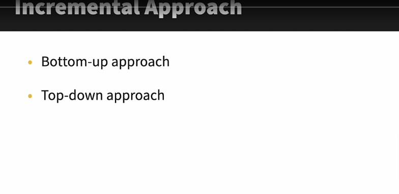

### 3 type of TDD (Test Driven Development)
1. Unit Testing
    - A Software testing method which test components of software in isolation to validate that each unit of the softwaer meets the requirements and behaves as expected
##### The importance of units Testing
- Improve Code quality
- Debugging is easier
- Increases code reliability

##### Best Practices
- Clear and consistent naming conventions
- Cases should be independent
- Verify one use case per test
- Fix Bugs before moving forward

2. Integratoin Testing
- Ensure they work together as expected
- Expose any defects

#### Integration Testing Approaches
1. Big Bang Approach
- Combine all module(unit) testing all at once

2. Incremental Approach

### Drivers and Stubs
Stubs and drivers are dummy programs in Integration Testing used to replace missing modules to failitate testing processes.

3. End to End/E2E Testing
- End to End testing involves testing the different flows a use might take in a software system from begining to end.

1. Horizontal E2E Testing
- User Perspective

2. Vertical E2E Testing
- Involves testing critical components of a system from start to finish to ensure quality. 
- These components usually do not involve user interface
- Mostly used for complex software system
